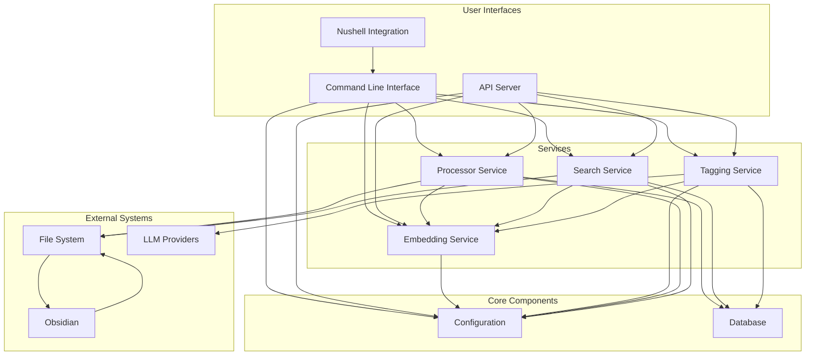
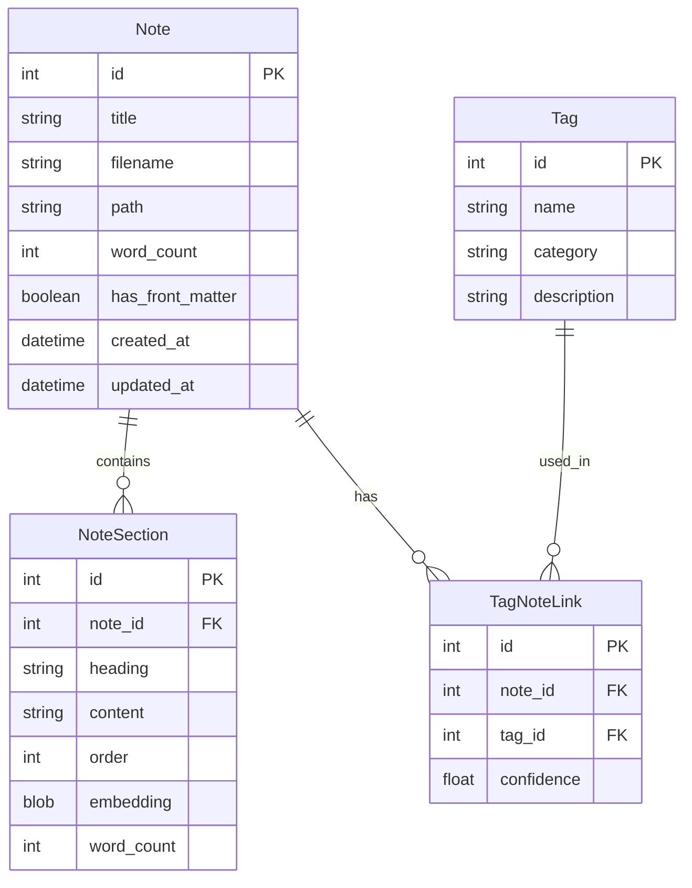

# Note Organizer

A powerful note organization system for Obsidian and other markdown-based note systems, using modern embedding techniques and LLM capabilities.

## Features

- **Semantic Search**: Find notes based on meaning, not just keywords
- **Automatic Tagging**: Intelligent tag suggestions using embeddings and LLMs
- **Markdown Processing**: Parses and processes markdown content into sections
- **Efficient Embeddings**: Uses Clustered Compositional Embeddings (CCE) for fast, memory-efficient embeddings
- **RESTful API**: Access all functionality through a well-documented API
- **File Upload**: Easily import your existing markdown files
- **Front Matter Support**: Extracts and processes YAML front matter

## Installation

### Requirements

- Python 3.9+
- [uv](https://github.com/astral-sh/uv) (faster and more reliable than pip)

### Setup

1. Clone the repository:
   ```bash
   git clone https://github.com/yourusername/note-organizer.git
   cd note-organizer
   ```

2. Create a virtual environment and install the package:
   ```bash
   # Create and activate virtual environment
   python -m venv .venv
   source .venv/bin/activate  # On Windows: .venv\Scripts\activate
   
   # Install the package with uv
   uv pip install -e .
   ```

3. Initialize the system:
   ```bash
   note-organizer init
   ```

This will create a default configuration file at `~/.config/note_organizer/config.yaml` and set up the database.

## Configuration

The default configuration is created at `~/.config/note_organizer/config.yaml` and includes:

```yaml
debug: true
notes_dir: /path/to/your/notes
database:
  url: sqlite:///notes.db
  echo: false
api:
  host: 127.0.0.1
  port: 8000
  cors_origins:
  - http://localhost:3000
embedding:
  model_name: all-MiniLM-L6-v2
  use_cce: true
  cache_dir: .cache
openai:
  api_key: ''
  model: gpt-3.5-turbo
log:
  level: INFO
  path: logs
```

You should edit this file to:
- Set your `notes_dir` to point to your Obsidian vault or other markdown notes location
- Add your OpenAI API key if you want to use OpenAI for tagging (optional)

## Usage

### Command Line Interface

Note Organizer provides a comprehensive CLI for managing your notes:

```bash
# Initialize the system
note-organizer init

# Process your notes
note-organizer process --path /path/to/notes

# Start the API server
note-organizer api

# List all notes
note-organizer notes list

# Search notes (semantic search)
note-organizer notes search --query "your search query"

# Full-text search
note-organizer notes search --query "exact phrase" --full-text

# List all tags
note-organizer tags list

# Create a new tag
note-organizer tags create --name "concept" --category "topics"

# Get note statistics
note-organizer stats

# Configure settings
note-organizer config --llm openai --openai-key "your-api-key"

# Show current configuration
note-organizer config --show
```

For full documentation of available commands:

```bash
note-organizer --help
```

### Nushell Integration

Note Organizer provides seamless integration with [Nushell](https://www.nushell.sh/), a modern shell designed for data manipulation.

To install the Nushell integration:

```bash
note-organizer nushell --install
```

This will create a Nushell module in `~/.config/nushell/note_organizer.nu`. Add this to your Nushell configuration to use the commands:

```nushell
source ~/.config/nushell/note_organizer.nu
```

Example Nushell commands:

```nushell
# List all notes and show only those with more than 500 words
notes list | where word_count > 500

# Search for Python notes and sort by similarity
notes search "python" | sort-by similarity_pct | reverse

# Get tags and count how many are in each category
tags list | group-by category | get technical | length

# See note statistics
stats | get top_tags | sort-by count | reverse | first 5
```

### Start the API Server

```bash
python -m note_organizer api
```

This will start a FastAPI server on http://127.0.0.1:8000 (or your configured host/port).

### Process Your Notes

```bash
python -m note_organizer process --path /path/to/your/notes
```

This will scan your notes directory, index all markdown files, and process them.

### API Documentation

Once the server is running, you can access the API documentation at:
- http://127.0.0.1:8000/docs

### Example API Calls

#### Get all tags

```bash
curl -X GET http://127.0.0.1:8000/tags
```

#### Search notes

```bash
curl -X GET "http://127.0.0.1:8000/search?query=your%20search%20query"
```

#### Create a new note

```bash
curl -X POST http://127.0.0.1:8000/notes \
  -H "Content-Type: application/json" \
  -d '{"title":"New Note","content":"# New Note\n\nThis is a new note.","tags":["example"]}'
```

## Architecture

The system is organized into several modules:



The system is organized into several modules:

- **API**: FastAPI server and routes
- **Core**: Configuration and utility functions
- **DB**: Database models and connections
- **Services**: Business logic and processing

### Key Services

- **EmbeddingService**: Generates and manages text embeddings using sentence-transformers and CCE
- **TaggingService**: Creates and manages tags using rule-based and LLM approaches
- **ProcessorService**: Processes markdown files, extracts sections, and manages the processing pipeline
- **SearchService**: Provides semantic and full-text search capabilities for notes

### Service Architecture

Note Organizer uses a simple functional approach to services:

- **No Singletons or Global State**: Each service instance is created independently
- **Dependency Injection**: Services that need dependencies receive them as arguments
- **Composition Over Inheritance**: Services are composed together rather than inheriting from each other
- **Functional Interface**: The `service_factory.py` module provides functions to create service instances

Example usage:

```python
# Create services
from note_organizer.services.service_factory import create_embedding_service, create_tagging_service

# Create services with explicit dependencies
embedding_service = create_embedding_service()
tagging_service = create_tagging_service(embedding_service=embedding_service)

# Use the services
embedding = embedding_service.get_embedding("Some text")
tags = tagging_service.generate_tags_for_note("Note content", "Note title")
```

### Data Model



## Development

### Running Tests

```bash
pytest
```

### Building Documentation

```bash
cd docs
make html
```

## Obsidian Plugin (Planned)

Note Organizer will include an Obsidian plugin for seamless integration. The plugin will provide:

- **Quick Tag**: Tag notes directly from Obsidian
- **Semantic Search**: Search your notes by meaning without leaving Obsidian
- **Tag Management**: Browse and organize your tags
- **Suggestions**: Get automatic tag suggestions based on note content

The plugin is currently in development and will be available soon. The plugin will connect to the Note Organizer API server to provide these features.

## Drafts App Integration

Note Organizer now includes integration with the popular [Drafts app](https://getdrafts.com/) for iOS, iPadOS, and macOS, enabling a seamless workflow from quick capture to organized knowledge management.

### Features

- **AI-powered tagging**: Get intelligent tag suggestions for notes captured in Drafts
- **Content refinement**: Improve your writing with AI assistance directly in Drafts
- **Smart export to Obsidian**: Export notes to Obsidian with AI-suggested folder organization
- **Note splitting**: Break long notes into multiple focused notes with proper structure

### Getting Started with Drafts Integration

1. Install the Drafts actions from the `drafts_actions` directory
2. Configure your API connection in Drafts when prompted
3. Start capturing notes in Drafts and use the actions to process and organize them

For detailed setup and usage instructions, see the [Drafts Integration README](drafts_actions/README.md).

## License

MIT License

## Acknowledgements

- [sentence-transformers](https://github.com/UKPLab/sentence-transformers) for providing embedding models
- [DSPy](https://github.com/stanfordnlp/dspy) for LLM programming
- [FastAPI](https://fastapi.tiangolo.com/) for the API framework
- [SQLAlchemy](https://www.sqlalchemy.org/) for database ORM
- [PyYAML](https://pyyaml.org/) for YAML processing 